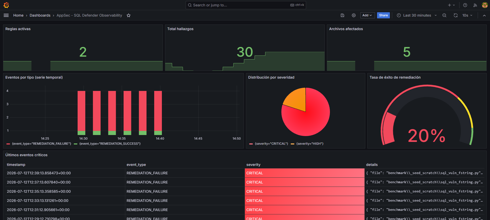

# AppSec Scanner — detección, remediación y auditoría de vulnerabilidades en Python

Motor de análisis estático (AST) que detecta clases de vulnerabilidad en código Python,
decide **con criterio explícito** qué se puede remediar automáticamente sin riesgo,
y deja un rastro de auditoría estructurado listo para observabilidad (Loki/Grafana)
y para actuar como gate de seguridad en CI/CD.

No es un linter más. Es la pieza que le falta a la mayoría de escáneres personales:
**evidencia auditable de que la detección y la remediación realmente ocurrieron**,
que es justo lo que pide un equipo de compliance (SOC 2, ISO 27001) o un revisor
técnico senior.



---

## Por qué existe

La mayoría de proyectos de seguridad en portfolios se quedan en "detecté la
vulnerabilidad". Eso es el 20% del problema. El 80% restante — y el que de verdad
importa en un equipo real — es:

1. ¿Qué se puede arreglar automáticamente **sin romper nada**, y qué no?
2. ¿Cómo queda evidencia de esa decisión, verificable por un tercero?
3. ¿Cómo se integra esto en el pipeline para que nadie tenga que acordarse de correrlo?

Este lab responde a las tres preguntas con código que corre, no con diapositivas.

---

## Qué detecta hoy

| Regla | Qué busca | ¿Se remedia solo? |
|---|---|---|
| `sql_injection` | SQL construido con f-string, concatenación o `%`-format | Solo el caso `%`-format — es el único demostrablemente seguro sin ejecutar el código |
| `path_traversal` | Rutas dinámicas en `open()`, `os.remove()`, `os.unlink()`, `os.rmdir()`, `shutil.rmtree()` | No — no existe una reescritura genérica segura sin conocer el directorio base permitido de cada contexto |

La arquitectura está pensada para crecer: cada regla implementa una interfaz `Rule`
común, así que añadir una tercera clase de vulnerabilidad no toca el resto del motor.

---

## Evidencia real de ejecución (no simulada)

Esto es la salida real de correr el motor sobre el propio corpus de prueba:

```
$ python appsec_scanner/scanner.py benchmark/cases --audit-log tests/demo_audit.jsonl
AppSec scan: 5 hallazgo(s) totales
```

Remediación automática del único caso seguro (`%`-format → consulta parametrizada):

```diff
- query = "SELECT * FROM orders WHERE id = %s" % order_id
+ query = "SELECT * FROM orders WHERE id = ?", (order_id,)
```

Gate de CI bloqueando correctamente cuando quedan hallazgos `CRITICAL` sin remediar:

```
$ python appsec_scanner/scanner.py benchmark/cases --fail-on-critical
AppSec gate: 4 hallazgo(s) CRITICAL sin remediar
$ echo $?
1
```

Benchmark contra el corpus etiquetado:

```
TP=5 FP=0 FN=0 TN=5
Precisión: 1.00  Recall: 1.00  F1: 1.00

sql_injection:   {'tp': 3, 'fp': 0, 'fn': 0, 'tn': 2}
path_traversal:  {'tp': 2, 'fp': 0, 'fn': 0, 'tn': 2}
```

**Nota de honestidad, a propósito, en negrita:** este benchmark es un corpus propio
de 10 casos, no el corpus oficial OWASP Benchmark (ese proyecto evalúa Java/JVM y
no aplica a un escáner Python). Un F1 de 1.00 sobre 10 casos construidos por el
mismo autor del motor valida que la lógica se comporta como se diseñó — no es
una garantía de generalización a código de producción real. El detalle completo
de esta limitación, y de qué queda deliberadamente fuera de alcance, está en
[`docs/modelo_de_amenazas.md`](docs/modelo_de_amenazas.md).

---

## Cómo correrlo

```bash
# Detectar sin modificar nada
python appsec_scanner/scanner.py <directorio> --audit-log tests/security_audit.jsonl

# Detectar y remediar automáticamente lo que es seguro remediar
python appsec_scanner/scanner.py <directorio> --fix

# Usarlo como gate de CI (sale con código 1 si hay CRITICAL sin remediar)
python appsec_scanner/scanner.py <directorio> --fail-on-critical

# Validar las métricas del motor
python benchmark/run_benchmark.py
```

Integración lista para GitHub Actions en [`ci/appsec-gate.yml`](ci/appsec-gate.yml):
corre el escaneo, bloquea el PR si hay críticos sin resolver, corre el benchmark
y publica el log de auditoría como artefacto descargable.

---

## Cómo levantar el stack de observabilidad (probado localmente)

```bash
cd infra
docker compose up -d
docker compose ps    # confirma que loki, promtail y grafana estén "Up"

cd ..
python appsec_scanner/scanner.py benchmark/cases --audit-log tests/security_audit.jsonl --fix
```

Abre `http://localhost:3000` (usuario/clave: `admin`/`admin`) →
**Connections → Data sources → Add data source → Loki** → URL `http://loki:3100`
→ **Save & test**. Luego **Dashboards → Import** → sube
`grafana/grafana_dashboard.json` y selecciona el data source `loki`.

---

## Observabilidad

Los eventos se escriben en JSONL (`event_type`, `severity`, `details`, `timestamp`),
formato pensado para Promtail → Loki → Grafana. La infraestructura completa está
en [`infra/`](infra/) (`docker-compose.yml` con Loki + Promtail + Grafana) y el
dashboard importable en [`grafana/grafana_dashboard.json`](grafana/grafana_dashboard.json).

**Este stack fue levantado y corrido localmente, no es solo una configuración
teórica.** El dashboard incluye 7 paneles con datos reales generados por el
propio motor:

- **Total hallazgos / Archivos afectados / Reglas activas** — stats con sparkline
- **Eventos por tipo** — serie temporal (barras) de `REMEDIATION_SUCCESS` vs
  `REMEDIATION_FAILURE`, coloreada por severidad
- **Distribución por severidad** — pie chart con thresholds correctos
  (crítico en rojo, no en verde — ese fue justamente uno de los bugs que
  encontramos y corregimos durante la construcción)
- **Tasa de éxito de remediación** — gauge con thresholds (rojo <50%, verde >80%)
- **Últimos eventos críticos** — tabla limpia, sin JSON crudo, con severidad
  coloreada como fondo de celda

Para generar un historial real (no timestamps fabricados) y ver la serie
temporal con varios puntos en vez de un solo pico, usa
[`infra/seed_history.py`](infra/seed_history.py): corre el scanner varias
veces con pausas reales entre cada ejecución.

La configuración exacta de cada panel (query LogQL, tipo de visualización,
overrides de color, transforms) está documentada en
[`docs/ficha_paneles_grafana.md`](docs/ficha_paneles_grafana.md), por si
necesitas reconstruir el dashboard desde cero.

**Nota de honestidad:** durante la construcción de este dashboard encontramos
y corregimos varios errores reales — una query con la etiqueta mal referenciada
que causaba "No data" en el panel de tasa de éxito, un panel de "Top archivos"
mal configurado como Bar gauge en vez de Bar chart, y un problema de encoding
(BOM de PowerShell) que hacía que el scanner descartara silenciosamente un
archivo del corpus. Documentamos el proceso completo en vez de solo mostrar
el resultado final, porque el criterio para diagnosticar y corregir esos
errores es, en sí mismo, parte de la evidencia técnica de este proyecto.

---

## Estructura del repositorio

```
appsec_scanner/scanner.py           # motor: interfaz Rule + AuditLogger + CLI
benchmark/                          # corpus etiquetado + cálculo de precisión/recall/F1
ci/appsec-gate.yml                  # workflow de GitHub Actions como gate real
infra/docker-compose.yml            # Loki + Promtail + Grafana, listo para docker compose up
infra/seed_history.py               # genera historial real (timestamps genuinos) para el dashboard
grafana/grafana_dashboard.json      # dashboard importable con 7 paneles
docs/modelo_de_amenazas.md          # alcance, exclusiones justificadas, límites metodológicos
docs/ficha_paneles_grafana.md       # queries y configuración exacta de cada panel
```

---

## Qué NO es este proyecto

Para que quede tan claro como lo que sí hace: esto no es un sustituto de un
pentest, no cubre ORMs (ya parametrizan por diseño), no sigue SQL ensamblado
vía `eval`/`exec`, y no remedia path traversal automáticamente porque no existe
una regla genérica segura para hacerlo. Cada exclusión está justificada en el
modelo de amenazas, no omitida por descuido.

---

## Pendientes conocidos (honestos, no resueltos todavía)

- **MTTR (tiempo medio de remediación):** no se puede calcular con el esquema
  de log actual, porque cada evento es independiente y no existe un ID de
  correlación entre "detección" y "remediación" del mismo hallazgo. Requeriría
  modificar `AuditLogger` para emitir un par de eventos correlacionados.
- **Alerta de Grafana** ante una tasa de fallo alta: el panel está listo para
  configurarla (pestaña Alert), pero falta definir un Contact point
  (Slack/email) antes de que pueda notificar a algún lado.
- **Benchmark ampliado:** las métricas actuales son sobre 10 casos propios,
  no sobre código de producción real de terceros (ver limitación explícita
  en `docs/modelo_de_amenazas.md`).


## Security Standards 🔐

Este repositorio sigue normas rigurosas de seguridad para garantizar la integridad de la cadena de suministro de software (*Software Supply Chain Integrity*):

* **GPG Signing:** Todos los *commits* están firmados digitalmente mediante una clave GPG para garantizar la autenticidad de la autoría.
* **Automated Security Headers:** Los archivos de código fuente incluyen encabezados de autoría inyectados automáticamente mediante *Git hooks* (`pre-commit`), asegurando la estandarización y trazabilidad.
* **Git Integrity:** Se emplea un archivo `.gitignore` restrictivo para prevenir la exposición accidental de secretos, registros (*logs*) o datos sensibles.
